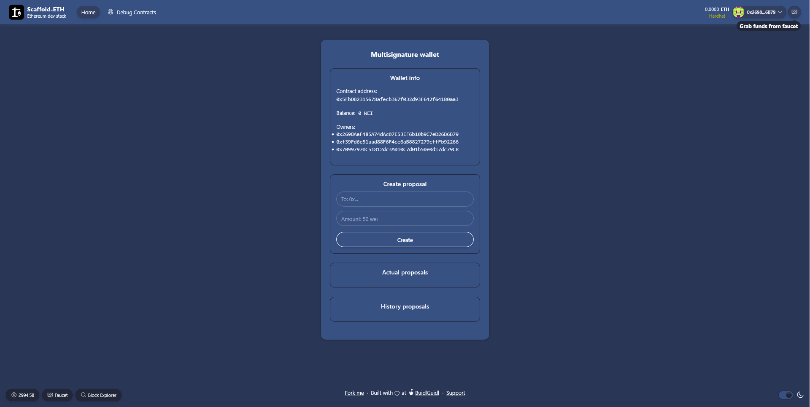
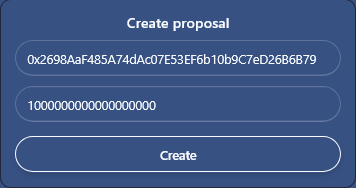
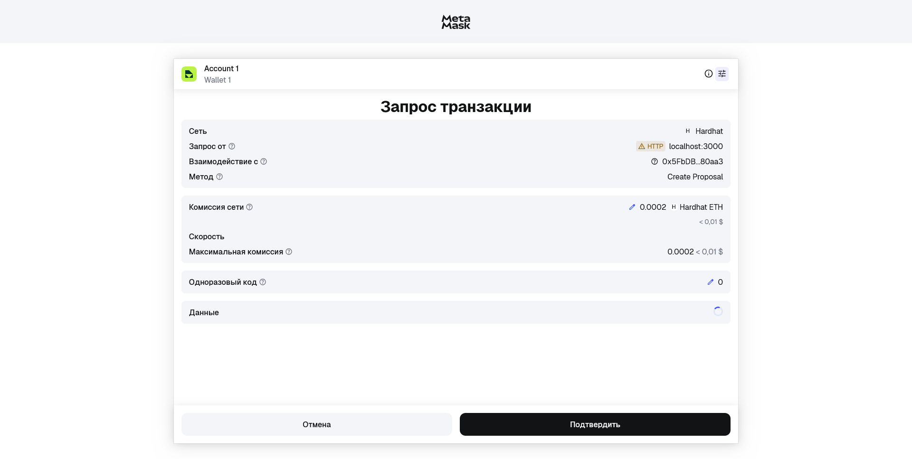
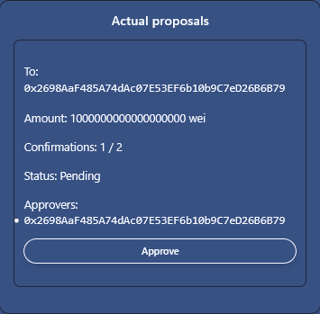
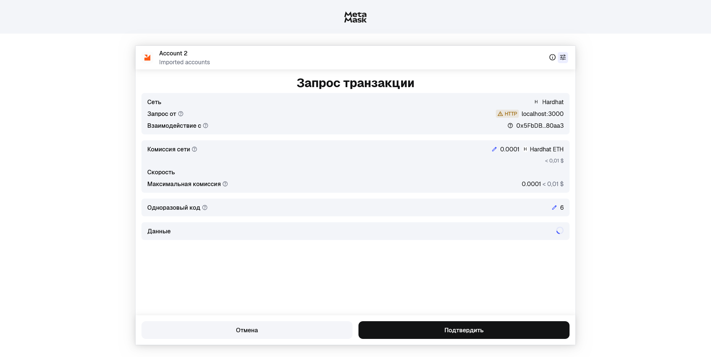
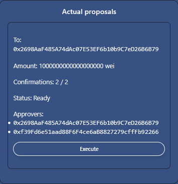
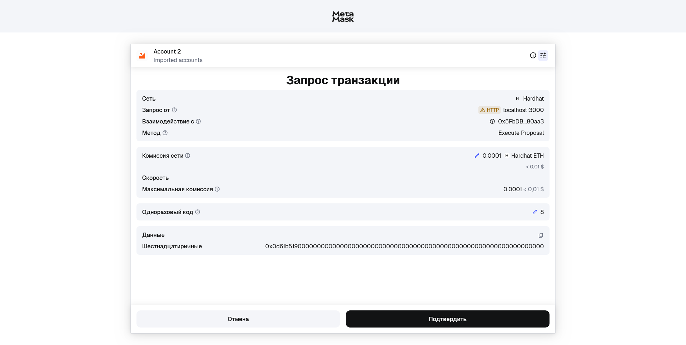
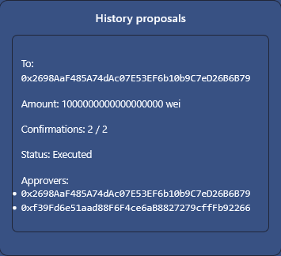

# MultisigWallet DApp

**MultisigWallet** — децентрализованный кошелек с мультиподписью, построенный на базе scaffold-eth-2. 
Позволяет группе владельцев совместно управлять средствами, создавая, одобряя и выполняя транзакции после достижения порога подтверждений.

---
## 🌟 Возможности кошелька

- **Создание предложений на перевод средств**  
  Владельцы кошелька могут создавать предложения с указанием получателя и суммы.

- **Одобрение предложений владельцами**  
  Каждый владелец может подтвердить предложение. Для выполнения требуется, чтобы количество подтверждений превышало половину от числа всех владельцев.

- **Автоматическое одобрение создателем**  
  Создатель предложения автоматически становится первым одобряющим.

- **Выполнение предложений после подтверждений**  
  Как только предложение набирает необходимое количество подтверждений, оно становится готовым к выполнению, и средства можно перевести.

- **Отмена предложения**  
  Только создатель предложения может его отменить, если оно ещё не выполнено.

- **Пополнение кошелька**  
  Контракт можно пополнять эфиром через receive/fallback.

- **Просмотр информации о кошельке**  
  - Баланс кошелька  
  - Список владельцев  
  - Список всех предложений и их статусы

---

## 📊 Смарт-контракт

**Контракт:** MultisigWallet.sol  
**Версия Solidity:** ^0.8.28  
**Лицензия:** MIT   
**Расположение:** packages/hardhat/contracts/MultisigWallet.sol  

### Основные функции:

| Название | Описание |
|-----------|----------|
| `createProposal(address recipient, uint amount)` | Создаёт предложение на перевод криптовалюты |
| `approveProposal(uint proposalId)` | Позволяет одобрить предложение владельцам кошелька |
| `executeProposal(uint proposalId)` | Выполняет предложение после достаточного количества подтверждений |
| `cancelProposal(uint proposalId)` | Позволяет владельцу предложения его отменить |
| `getOwners()` | Возвращает список владельцев |
| `getBalance()` | Возвращает баланс контракта |
| `getProposals()` | Возвращает список всех предложений |

### Особенности контракта:

- Владельцы кошелька задаются при деплое контракта  
- Создатель предложения автоматически становится первым одобряющим  
- Для выполнения предложения необходимо, чтобы количество подтверждений превышало половину всех владельцев  
- Смарт-контракт предотвращает повторное одобрение и выполнение предложений  

---

## 📋 Предварительные требования

- Node.js (версия 18 или выше)
- MetaMask или любой Web3-кошелек

---

## 🚀 Быстрый старт

### 1. Установите необходимые зависимости
```bash
yarn install
```

### 2. Запустите локальный блокчейн
```bash
yarn chain
```

### 3. Разверните смарт-контракт
```bash
yarn deploy
```

### 4. Запустите приложение
```bash
yarn start
```

### 5. Откройте приложение
Перейдите по адресу `http://localhost:3000` в вашем браузере.

---

## 📝 Руководство по использованию

### Главная страница
Если вы все сделали правильно, у вас должна загрузится главная страница кошелька



### 1️⃣ Создание нового предложения

Для создания предложения укажите адерс получателя и сумму в единицах WEI



Перейдите в MetaMask или другой web3 кошелек и подтвердите транзакцию



### 2️⃣ Подтверждение предложения

Все актуальные предложения расположены в соответсвующей секции "Actual Proposals". Для подтверждения перевода нажмите кнопку Approve.



Перейдите в MetaMask или другой web3 кошелек и подтвердите транзакцию



### 3️⃣ Выполнение предложения

По достижению необходимого числа подтверждений появится кнопка Execute. Для выполнения транзакции необходимо нажать на нее.

⚠️ **Важно! Убедитесь, что криптовалюты на счете достаточно для совершения перевода.**



Перейдите в MetaMask или другой web3 кошелек и подтвердите транзакцию



### История предложений

Все выполненные и отмененные предложения попадают в отдельную секцию "History proposals".



---

## 🏁 Заключение

MultisigWallet — это учебный проект, созданный для изучения смарт-контрактов с мультиподписями и создания приложения на базе scaffold-eth-2.  

⚠️ **Важно:** Перед использованием в основной сети (Mainnet) необходимо провести **полноценный аудит контракта**, так как данный проект предназначен только для образовательных целей и может содержать уязвимости.  

Используйте этот проект на тестовых сетях (Sepolia, Goerli и др.) для безопасного изучения и тестирования функционала.
